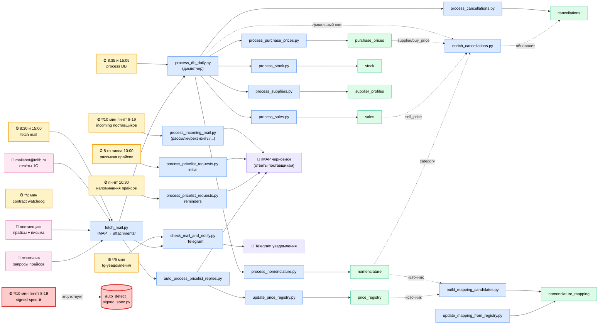

# ARCHITECTURE.md — Карта проекта category-manager

> Точка входа в архитектуру: кроны → скрипты → таблицы → выходы.
> Обновлено: 2026-06-26

## 🗺 Полная карта связей



---

## 📅 Кроны (crontab)

| # | Расписание | Команда | Назначение | Лог |
|---|---|---|---|---|
| 1 | 8:30 / 15:00 ежедн. | `fetch_mail.py` | Забор IMAP → `mail/attachments/` | `/tmp/fetch_mail.log` |
| 2 | 8:35 / 15:05 ежедн. | `process_db_daily.py` | Распределение отчётов 1С по обработчикам | `/tmp/process_db_daily.log` |
| 3 | каждые 5 мин | `check_mail_and_notify.py` | Telegram-нотификации новых писем | `/tmp/mail_check.log` |
| 4 | каждые 10 мин, пн-пт 8-19 | `process_incoming_mail.py` | Обработка писем поставщиков | `/tmp/process_incoming_mail.log` |
| 5 | 🔴 каждые 10 мин, пн-пт 8-19 | `auto_detect_signed_spec.py` | ❌ СКРИПТА НЕТ (остался pyc) | `/tmp/auto_detect_signed_spec.log` |
| 6 | каждые 2 мин | `/tmp/contract_watchdog.sh` | watchdog (внешний, проверить) | — |
| 7 | 8-го числа в 10:00 | `process_pricelist_requests.py initial` | Рассылка запросов прайсов (8 поставщиков) | `/tmp/pricelist_initial.log` |
| 8 | пн-пт 10:30 | `process_pricelist_requests.py reminders` | Напоминания по неотвеченным | `/tmp/pricelist_reminders.log` |

---

## ⚙️ Потоки данных

### Поток 1. Отчёты 1С (ежедневно)
```
mailshot@tdlfb.ru
  → fetch_mail.py (8:30 / 15:00)
    → mail/attachments/
      → process_db_daily.py (8:35 / 15:05)
        [сортировка по приоритету ROUTING]
        1. nomenclature       (Универсальный отчет)
        2. purchase_prices    (Анализ закупок)
        3. sales              (Продажи по номенклатуре)
        4. stock              (Остатки и доступность)
        5. supplier_profiles  (Уровень сервиса)
        6. contract_terms     (Условия договоров → CSV)
        7. cancellations      (Отмены заказов)
        → enrich_cancellations.py   ← финальный шаг
```

Почему такой порядок: `cancellations` обогащается из `purchase_prices` (supplier, buy_price), `sales` (sell_price), `nomenclature` (category). Поэтому источники грузятся первыми.

### Поток 2. Прайс-листы поставщиков (раз в месяц + ответы)
```
8-го числа 10:00
  → process_pricelist_requests.py initial → IMAP черновики 8 поставщикам
пн-пт 10:30 (последующие дни)
  → process_pricelist_requests.py reminders → напоминания

Поставщик отвечает
  → fetch_mail.py
    → auto_process_pricelist_replies.py
      → update_price_registry.py → price_registry
        → build_mapping_candidates.py → nomenclature_mapping
        → update_mapping_from_registry.py → nomenclature_mapping
```

### Поток 3. Входящие письма от поставщиков (рабочее время)
```
поставщики
  → fetch_mail.py (или прямо в IMAP)
    → process_incoming_mail.py (каждые 10 мин, пн-пт 8-19)
      → классификация:
        - повышение цен      → IMAP черновик ответа
        - смена реквизитов   → IMAP черновик ответа
        - срывы поставок     → supplier_warning
        - прайс-листы        → update_price_registry.py
        - прочее             → пометка категорией
```

### Поток 4. Telegram-уведомления
```
каждые 5 мин
  → check_mail_and_notify.py
    → новые непрочитанные письма с фильтрами
      → Telegram (бот)
```

---

## 🗄 Таблицы БД (category.db)

| Таблица | Записей (snapshot 2026-06-26) | Источник | Обновляется |
|---|---:|---|---|
| `nomenclature` | 7 390 | 1С «Универсальный отчет» | ежедн. |
| `purchase_prices` | 15 411 | 1С «Анализ закупок» | еженед. |
| `sales` | (большая) | 1С «Продажи по номенклатуре» | ежедн. |
| `stock` | 8 335 | 1С «Остатки и доступность» | ежедн. |
| `supplier_profiles` | 326 | 1С «Уровень сервиса» + ручное | ежедн./ручн. |
| `cancellations` | 60 805 | 1С «Отмены заказов» | по поступлению |
| `price_registry` | 20 832 | Прайсы от поставщиков | по поступлению |
| `nomenclature_mapping` | 250 205 | `nomenclature` × `price_registry` | по запуску |

### Обогащение `cancellations` (после INSERT)
```
cancellations.supplier      ← purchase_prices.supplier        (по article)
cancellations.buy_price     ← purchase_prices.price_with_vat  (по article + дата ≤ cancel_date)
cancellations.sell_price    ← sales.price_with_vat            (по article + дата ≤ cancel_date)
cancellations.category      ← nomenclature.category           (по article)
cancellations.lost_revenue  = qty × (sell_price || buy_price || 0)
```

`nomenclature_mapping` НЕ участвует в обогащении `cancellations`. Она нужна для связки «наша номенклатура ↔ позиция в прайсе поставщика» — используется в скиллах `article-search`, `price-comparison`, `supplier-substitution-search`.

---

## 📁 Скрипты — короткая справка

См. полную таблицу в `TOOLS.md`. Здесь только участники потоков.

| Группа | Скрипт | Что делает |
|---|---|---|
| Почта | `fetch_mail.py` | IMAP → attachments/ |
| Почта | `check_mail_and_notify.py` | Telegram-нотификации |
| Почта | `process_incoming_mail.py` | Классификация писем поставщиков |
| Почта | `auto_process_pricelist_replies.py` | Автозагрузка ответов на запросы прайсов |
| Почта | `send_mail.py` | Отправка SMTP |
| Прайсы | `process_pricelist_requests.py` | Рассылка/напоминания запросов прайсов |
| Прайсы | `update_price_registry.py` | Запись прайса в price_registry |
| Прайсы | `build_mapping_candidates.py` | nomenclature × price_registry → mapping |
| Прайсы | `update_mapping_from_registry.py` | Обновление маппинга |
| Отчёты 1С | `process_db_daily.py` | Диспетчер по имени файла |
| Отчёты 1С | `process_nomenclature.py` | Парсинг справочника |
| Отчёты 1С | `process_purchase_prices.py` | Парсинг анализа закупок |
| Отчёты 1С | `process_sales.py` | Парсинг продаж |
| Отчёты 1С | `process_stock.py` | Парсинг остатков |
| Отчёты 1С | `process_suppliers.py` | Парсинг уровня сервиса |
| Отчёты 1С | `process_cancellations.py` | Парсинг отмен |
| Отчёты 1С | `enrich_cancellations.py` | Пересчёт обогащения cancellations |

---

## 🔴 Известные проблемы

| # | Что | Где | Что делать |
|---|---|---|---|
| 1 | Битый крон: `auto_detect_signed_spec.py` — файла нет, остался pyc | crontab `*/10 8-19 * * 1-5` | удалить строку из crontab ИЛИ восстановить скрипт |
| 2 | `/tmp/contract_watchdog.sh` — назначение неясно | crontab `*/2 * * * *` | проверить, нужен ли |
| 3 | Логи в `/tmp/` теряются при перезагрузке | все логи | вынести в `~/.openclaw/.../logs/` |
| 4 | Нет ротации логов | все логи | logrotate или cron-чистка |
| 5 | Нет уведомлений о падении кронов | все | wrap-обёртка с алертом в Telegram при ошибке |
| 6 | `cancellations.supplier` пуст у 941 строки за май/причина 01 (1,51 млн ₽) | `cancellations` | артикулы, которых никогда не было в `purchase_prices` — снятые/новые/служебные SKU. Чинится только ручным маппингом или дочисткой исходного отчёта закупок |

---

## 🔗 См. также

- `AGENTS.md` — роль агента, структура workspace
- `MEMORY.md` — карта памяти, скиллы, правила работы
- `TOOLS.md` — полный список скриптов с расписанием
- `SOUL.md` — стиль и границы
- `USER.md` — про пользователя
